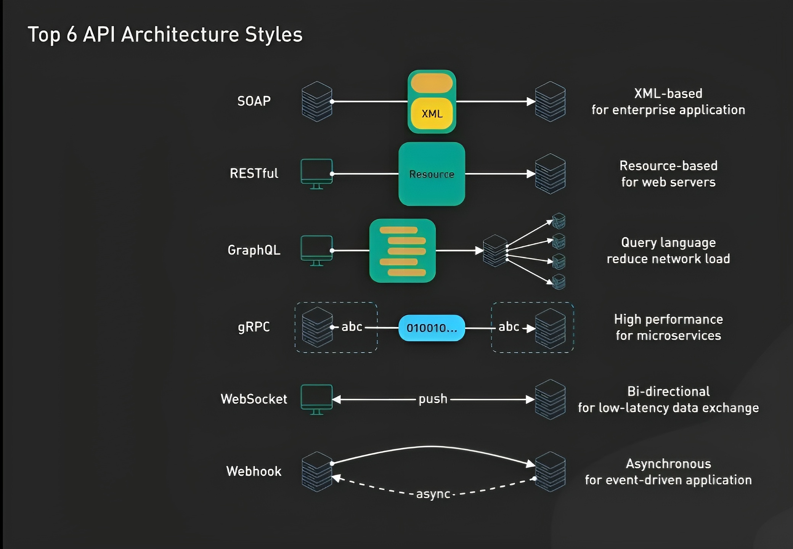

# _1.What is REST?_
>_1. Representational State Transfer-(передача статуса «самоописанный»)-(ҳолати тарҷумаи "худ тавсифшуда")_

>_2.Architecture style for designing newtworked applications-(Архитектурный стиль для разработки новых приложений.)_

>_3.Relies on a stateless, client-server protocal almost always HTTP(Полагается на клиент-серверный протокол без сохранения состояния, почти всегда HTTP.)(Ба протоколи муштарӣ-сервери бидуни шаҳрвандӣ такя мекунад, қариб ҳамеша HTTP)_

>_4.Treats server objects as resources that can be created or destroyed-(Рассматривает объекты сервера как ресурсы, которые можно создавать или уничтожать.)-(Ба объектҳои сервер ҳамчун захираҳое муносибат мекунад, ки онҳоро сохтан ё нобуд кардан мумкин аст)_

>_5.Can be used by virtually any programming language(Может использоваться практически любым языком программирования.)_

> ## _REST was initially created as a guideline to manage communication on a complex network like the internet. You can use REST-based architecture to support high-performing and reliable communication at scale. You can easily implement and modify it, bringing visibility and cross-platform portability to any API system.(REST дар аввал ҳамчун дастур барои идоракунии муошират дар шабакаи мураккаб ба монанди интернет сохта шудааст. Шумо метавонед меъмории асоси REST-ро барои дастгирии иртиботи баландсифат ва боэътимод дар миқёс истифода баред. Шумо метавонед онро ба осонӣ татбиқ ва тағир диҳед, ки ба ҳама гуна системаи API намоёнӣ ва интиқоли байниплатформавӣ меорад.)(REST изначально создавался как руководство по управлению связью в такой сложной сети, как Интернет. Вы можете использовать архитектуру на основе REST для поддержки высокопроизводительной и надежной связи в любом масштабе. Вы можете легко реализовать и изменить его, обеспечивая прозрачность и межплатформенную переносимость любой системы API.)_

>_So, REST is a way for computers to communicate using standard rules and formats, making it easier for different systems to work together.(Итак, REST — это способ взаимодействия компьютеров с использованием стандартных правил и форматов, облегчающий совместную работу различных систем.)(Ҳамин тавр, REST як роҳи муоширати компютерҳо бо истифода аз қоидаҳо ва форматҳои стандартӣ мебошад, ки якҷоя кор кардани системаҳои гуногунро осон мекунад.)_

# _2.What is API?_
> _1.APIs are mechanisms that allow two software components to communicate with each other using a set of definitions and protocols.API – это механизмы, которые позволяют двум программным компонентам взаимодействовать друг с другом, используя набор определений и протоколов. (APIҳо механизмҳое мебошанд, ки ба ду ҷузъи нармафзор имкон медиҳанд, ки бо истифода аз маҷмӯи таърифҳо ва протоколҳо бо ҳамдигар муошират кунанд.)_

> ## _1.What is mean-API – Application Programming Interface, что значит программный интерфейс приложения._

> ## _2.How work API-Архитектура API обычно объясняется с точки зрения клиента и сервера. Приложение, отправляющее запрос, называется клиентом, а приложение, отправляющее ответ, называется сервером. Итак, в примере с погодой база данных службы – это сервер, а мобильное приложение – это клиент.(Меъмории API одатан аз нуқтаи назари муштарӣ ва сервер шарҳ дода мешавад. Барномае, ки дархост мефиристад, муштарӣ номида мешавад ва барномае, ки посухро мефиристад, сервер номида мешавад. Ҳамин тавр, дар мисоли обу ҳаво, пойгоҳи додаҳои хидмат сервер ва барномаи мобилӣ муштарӣ мебошанд.)_

> ## _3.What is SOAP API?-SOAP – Simple Object Access Protocol, т. е. простой протокол доступа к объектам. Клиент и сервер обмениваются сообщениями посредством XML. Это менее гибкий API, который был более популярен в прошлом._

> ## _4.What is Websocket API?-это еще одна современная разработка web API, которая использует объекты JSON для передачи данных. WebSocket API поддерживает двустороннюю связь между клиентскими приложениями и сервером. Сервер может отправлять сообщения обратного вызова подключенным клиентам, что делает его более эффективным, чем REST API.(Ин боз як таҳияи муосири веб API мебошад, ки объектҳои JSON-ро барои интиқоли маълумот истифода мебарад. WebSocket API иртиботи дуҷонибаи байни барномаҳои муштарӣ ва серверро дастгирӣ мекунад. Сервер метавонад паёмҳои бозпас зангро ба муштариёни пайваст фиристад, ки онро нисбат ба REST API самараноктар мекунад.)_

>#HTTP Request / Response. Communication between clients and servers is done by requests and responses: A client (a browser) sends an HTTP request ...